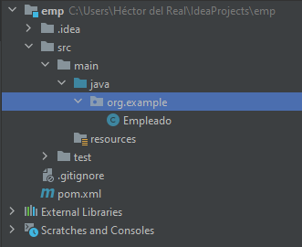
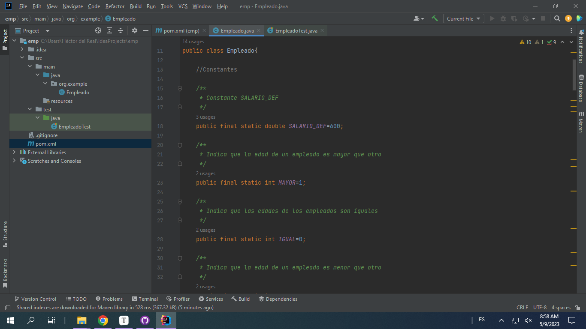
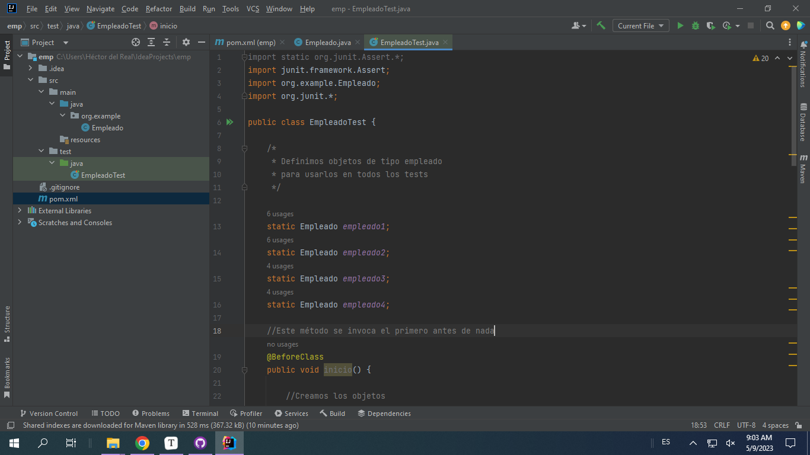
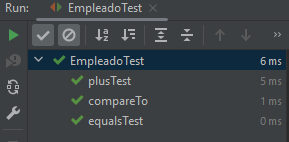

# Pruebas unitarias

## 1. ¿Qué diferencia existe entre las pruebas estáticas y dinámicas?

En las pruebas estáticas no se ejectua la aplicación mientras que las dinámicas se realizan ejecutando la aplicación.

## 2. ¿Qué diferencia existe entre las pruebas de caja negra y caja blanca?

En las pruebas de caja negra no vemos el código de la aplicación, en las de caja blanca vemos el código fuente y su ejecución.

En las de caja negra se tienen en cuenta las entradas y salidas sin tener en cuenta lo que suceda dentro de la aplicación, en las de caja blanca se comprueban los flujos de ejecución dentro del código.

## 3. ¿Qué diferencia existe entre las pruebas funcionales y no funcionales?

Las pruebas funcionales evalúan que la aplicación cumpla con los requisitos propuestos, las no funcionales evalúan otros aspectos como el rendimiento o la seguridad de nuestra aplicación.

## 4. Nombra al menos 4 pruebas funcionales.

* Pruebas unitarias
* Pruebas de regresión
* Pruebas de humo
* Pruebas de aceptación

## 5. Nombra al menos 4 pruebas no funcionales.

* Pruebas de usabilidad
* Pruebas de estrés
* Pruebas de seguridad
* Pruebas de compatibilidad

## 6. ¿Qué són las pruebas unitarias o pruebas de unidad?

Es un tipo de prueba funcional con la que comprobamos el funcionamiento de las unidades individuales.

## 7. ¿Qué són las pruebas de regresión?

Son pruebas que realizamos cuando hay un cambio en el programa para comprobar que los casos que ya habían sido probados anteriormente sigan funcionando correctamente.

## 8. ¿Qué son las pruebas de integración?

En las pruebas de integración se comprueba que los componentes de nuestra aplicación interactúan entre sí y estan unidos eficientemente.

## 9. ¿Qué son las pruebas de humo?

Son pruebas rápidas para comprobar que el software funciona y no tiene defectos que interrumpan el funcionamiento del programa.

## 10. ¿Qué son las pruebas alpha?

Son pruebas que realizamos creando un prototipo de la aplicación realizado rápidamente y de poco coste para poder experimentar.

## 11. ¿Qué son las pruebas beta?

Las pruebas beta se realizan cuando el sistema pasa a ejecutarse en un entorno real. Pretenden encontrar problemas que no han sido descubiertos por los desarrolladores ni el equipo de pruebas. Estas pruebas las realizan normalmente clientes finales.

## 12. ¿Qué son las pruebas de aceptación?

Son las últimas pruebas que se realizan, en ellas el cliente prueba el software y comprueba que cumple con sus expectativas.

## 13. Instala el plugin Maven para Intellij.

## 14. Crea un proyecto nuevo de tipo *`Maven`* y nombre *`empleado`*, que contenga la clase principal *`Empleado`*.

## 15. En *`Sources Packages`* edita el código de la clase *`Empleado`* y en *`Test Packages`* edita el código de la clase *`EmpleadoTest`*.

## 16. Pulsa **`Alt+F6`** para construir y ejecutar las pruebas.

