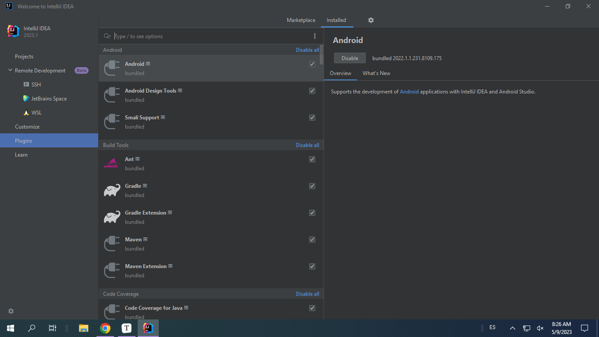

## 13. Instala el plugin Maven para Intellij.

## 14. Crea un proyecto nuevo de tipo *`Maven`* y nombre *`empleado`*, que contenga la clase principal *`Empleado`*.

## 15. En *`Sources Packages`* edita el código de la clase *`Empleado`* y en *`Test Packages`* edita el código de la clase *`EmpleadoTest`*.

## 16. Pulsa **`Alt+F6`** para construir y ejecutar las pruebas.

