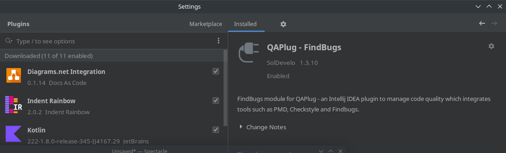
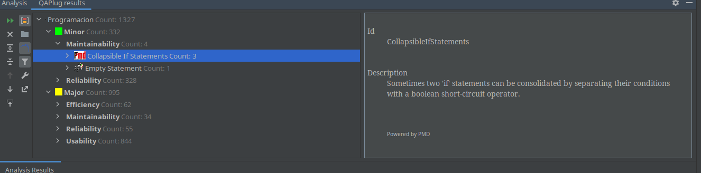
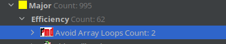
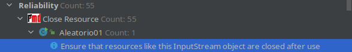
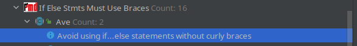

# Optimización

## 1. Que se entiende por hediondez de código

La hediondez de código no son bugs de programación en sí, sino deficiencias en el diseño de software que pueden ralentizar el desarollo o aumentan el riesgo de errores o fallos.

Ejemplos comunes: código duplicado,  identificadores demasiado largos, identificadores demasiado cortos, clases demasiado grandes y demasiados parámetros

## 2. ¿Qué tipo de herramienta utilizamos para hacer análisis estático del código?

Mediante analizadores estáticos y mediante páginas web de inspección de código.

## 3. ¿Qué sitios web nos permiten hacer análisis estático del código o **Continuous Inspection**?

Scrutinizer: de pago, 49€ al mes con el plan más barato.

SonarQube: Gratis para proyectos OpenSource.

## 4. Instala en IntelliJ el plugin **FindBugs**, si no lo tienes aún instalado.

## 5. Realiza **análisis estático de código** para las clases del proyecto programacion

## 6. Indica al menos un code smell relevante de cada clase. Explica cómo podría solucionarse.

Eficiencia: 

Se podria solucionar usando un metodo en vez de copiar el array a mano

Mantenimiento:

Se podria solucionar usando la variable o eliminando la variable inutilizada

Fiabilidad:

Se puede solucionar cerrando el Scanner con s.close()

Usabilidad:

Se podria solucionar añadiendo las llaves al if.

## 7. ¿Qué es la refactorización?

Es el proceso de reestructurar el codigo fuente alterando su estructura interna pero sin cambiar su comportamiento externo. 

## 8. Qué técnicas se utilizan a menudo a la hora de refactorizar? 

Para refactorizar se utilizan tecnicas como el renombrado de variables, pasar codigo duplicado a funciones, eliminizacion de codigo inalcanzable, redundante y muerto.